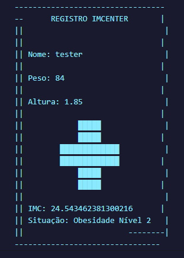

# **CALCULO IMC PROFESSOR CALVO HENRIQUE (NAO SE ABALE ESSE EH O DESTINO DE TODOS)**

esse README existe pq eu curto documentar oq eu faço principalmente pra discutir com outras pessoas entao a linguagem fica bem informal pq esse eh o jeito que eu gosto de falar, ou seja, eh mais pra colocar oq ta na cabeça mais rápido entao fica a vontade pra ler sem muito compromisso;

inicialmente eu tive a ideia de criar uma organizaçao médica fictícia q nao existe obviamente, mas acontece que existem umas 235 com o mesmo nome mas mesmo assim eu curti mt e acabei deixando com um destaque especial da ASSISTENCIA DE CELULARES IMCENTER DA ITALIA mo nada a ve
https://www.instagram.com/im.center/

mas enfim, nas primeiras ideias que eu tive eu tentei algumas artes mas a grande maioria era de cara bombado, oq nao tem muito a ver com saúde ja que maioria desses caras sao alergicos á água, entao acabei mudando pra algo mais amigavel e discreto, inclusive lembrei agora se pronuncia íEMí CENTER caso algum INSANO leia IMCENTER literalmente. outra parte importante da formataçao eh que EH MUITO RUIM formatar texto no visualg, o bgl eh que pra adaptar textos que usam variáveis eh bem dificil pq exatamente como ja diz, o tamanho dos inputs variam, oq torna bem chato sinceramente, mas ta suave ja tive em piores (recursao eu ainda lhe destruo).

outro problema q eu dei de cara eh sobre o visualg nao conseguir interpretar texto multilinha, pelo jeito as barras nas ASCII art's fazem ele interpretar, pra driblar issoe nao ter que escrever milhoes de escreval e ficar impossibilitado de usar ''  ,// \\\ nas artes, eu (e alguns colegas na classe), estamos utilizando uma extençao chamada Design Líquido no VsCode 
https://marketplace.visualstudio.com/items?itemName=designliquido.designliquido-vscode;

ela permite interpretar codigo do visualg, com todas as ferramentas do VSCode, desse jeito o desenvolvimento dos projetos ficam MUITO mais facil, inclusive acho bacana apresentar isso pro resto dos alunos, ja que o VsCode permite temas dos mais diversos tipos inclusive com highlight das principais funçoes, igualzinho o visualg mesmo so que mt mais foda (https://prnt.sc/TsMdN-YBbl33) INCLUSIVE ja tem uma ferramenta de debug imbutida, oq tambem acho interessante mostrar pros novos alunos ja que permite eles analizarem o codigo com mais calma e já mostrando os comando disponíveis como montar a estrutura basica de um algoritmo (algoritmo, var, inicio) automaticamente ate eu posso mostrar tb suave coisa simples mesmo papo de colocar uma parada (um stop) no programa pra eles analizarem como ta; alem disso ja deixa os alunos acostumados com o layout do programa entao fica a ideia; pra executar os codigos tem 2 jeitos o comando run (sem debug):  e o comando run com debug:  

que eu ate prefiro pro dar mais informaçoes mesmo nao colocando nenhum ponto de parada no programa; a execuçao do programa fica aqui:

 que pode ser aberto com Ctrl + ` no VSCode; tem um site bem daora que tem uns temas q eu acho interessante mostrar tb https://vscodethemes.com/;

outro ponto eh q eu tive um problema com a execuçao ja q ficava aparecendo um erro de objeto que era justamente a funçao de limpartela que no console de debug aparentemente nao funciona;

se tem uma coisa que deixa qualquer um louco eh como o visualG lida com tipos, por ser fortemente tipada, tranformar numeros em strings faz qualquer um questionar a realidade; nesse caso a solucao foi transformar numero pra caracter e castar a funcao compr pra pegar o comprimento, entao enquanto o comprimento nao for o da folha, ele coloca espaços em branco, completando no final a folha com um |, a folha fico parecendo que ta picotada na ponta pq o debug console junta linhas iguais, entao a folha ficaria parecendo um bilhete; depois ficou facil, copiei a funçao e adaptei pra cada variavel, ve oq ce fez funcionando eh mt pica; 

no final so adaptei a condicional do IMC pra ficar certinho e adicionar a recomendação;

demorei umas 7/8 horas pra finalizar o projeto todo e sobre essa experiencia apenas digo que o visualg levou mais uma vitima a beira da LOUCURA;